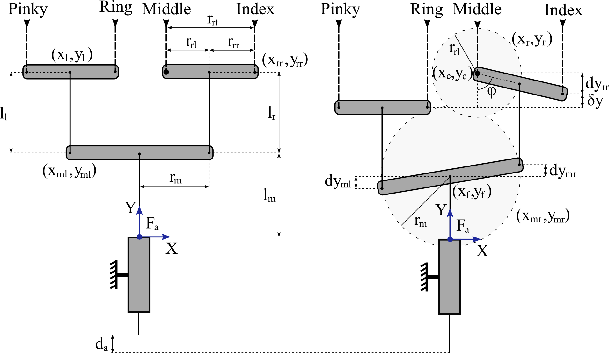

# Introduction #

A design optimization framework to derive optimal differential mechanism parameters, according to abduction motion of metacarpophalangeal (MCP) joint. For the index adduction/abduction, we employ the selectively lockable differential mechanism that has the ability to vary its displacement when fingers are locked. To simplify the kinematic analysis, we assume that tendons remain vertical and the input force of the differential mechanism is equally distributed to the remaining 3 digits.

## Working Example ##

In Figure 1, the design optimisation parameters of the differential mechanism are presented.

*Figure 1. Design optimisation parameters.*

Given the actuator displacement $d_{a}$, the main bar radius $r_{m}$, the index bar radius $r_{rl}$, the length of tendon tendon from actuator to the main bar $l_{m}$, and the length of tendon tendon from the main bar to the index bar $l_{r}$, we obtain the configuration of the index bar $(x_{r}, y_{r})$ and of the main bar $(x_{mr},y_{mr})$ by solving a nonlinear equality constraint optimisation scheme. Next, we can derive the full configuration of the differential mechanism.

## Notes ##

Please open a [GitHub issue](https://github.com/OpenBionics/Anthropomorphic-Robot-Hands/issues) if you encounter any problem.
